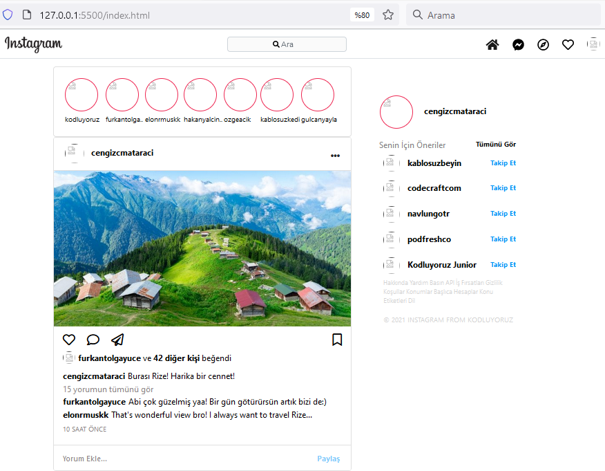

# Bootstrap Ödev-2

Kodluyoruz Eğitimi için Bootstrap konusunda ikinci ödevim.

Aşağıdaki ekran görüntüsü yer almaktadır.

## Instagram Clone Çalışması
# Verilen ödevdeki tüm istenenler clone üzerinde tamamlandı.
Sizden Beklediklerimiz

* Navbar'ı yukarı sabitleyip sayfayı aşağı kaydırdığınızda hala yukarıda durmasını sağlayın. İçerik ile birleşmemesi için body'e padding veriniz.
* Navbarın height'ı 54 px olmalı ve arkaplan rengi beyaz olmalı.
* Navbar'daki elementlerin doğru yerde olmadığını fark ettiniz mi? Öncelikle navbar'ın başındaki logo class'ının içine 192px soldan margin verin.
* Arama kısmını d-flex ile ortay alıp soldan 5 birim margin verin.
* CSS dosyası içindeki ::placeholder kısmının arkaplanına assets klasörü içinde bulunan arama simgesini ekleyin. Ve resmin tekrar etmemesini sağlayın.
* Clone ödevimizdeki ikonları FontAwesome sitesinden aldık. Daha detaylı bilgi için web sitesini ziyaret edin ve nasıl çalıştığını öğrenin.
* Sağ üstte yer alan ...
[Devamı için tıklayınız..](https://app.patika.dev/courses/bootstrap/odev2)
